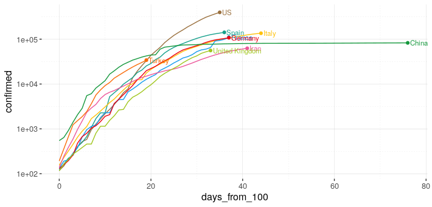

```{r setup, include=FALSE}
knitr::opts_chunk$set(
	echo = TRUE,
	message = FALSE,
	warning = FALSE
)
# the following code to sets up defaults for the document
library(ggplot2)
my_theme <- function (base_size = 12, base_family = "Helvetica") {
  theme_gray() +
    theme(
      rect = element_rect(fill = NA, linetype = 0, colour = NA, size = base_size/22),
      text = element_text(family = base_family, face = "plain", color = "black", size = base_size, hjust = 0.5, vjust = 0.5, angle = 0, lineheight = 0.9, margin = margin(), debug = FALSE),
      panel.border = element_blank(),
      panel.background = element_blank(),
      plot.caption = element_text(color = "grey70"),
         legend.title = element_blank(),
        legend.position = "right",
        panel.grid.minor.y = element_line(colour = "grey80"), 
        panel.grid.major.x = element_line(colour = "grey80", size = rel(0.25)),
        panel.grid.minor = element_line(size = rel(0.25), colour = "grey80", linetype = "dotted"),
        panel.grid.major.y = element_line(colour = "grey80", size = rel(0.3))
    )
}
theme_set(my_theme())
my_pal <- c("#9A703EFF", "#16A08CFF", "#FEC10BFF", "#149BEDFF", "#EE0011FF", "#15983DFF", "#EC579AFF", "#A1C720FF", "#FA6B09FF")
scale_colour_discrete <- function(...) {scale_colour_manual(..., values = my_pal)}
scale_fill_discrete <- function(...) {scale_fill_manual(..., values = rev(my_pal))}
```

<br/>  

## Academic Honesty Statement

**THIS IS AN INDIVIDUAL ASSESSMENT, THIS DOCUMENT AND YOUR ANSWERS ARE FOR YOUR EYES ONLY. ANY VIOLATION OF THIS POLICY WILL BE IMMEDIATELY REPORTED.**

*Replace the underscores below with your name acknowledging that you have read and understood your institution's academic misconduct policy.*

I, ____________, hereby state that I have not communicated with or gained information in any way from my classmates or anyone other than the Professor or TA during this exam, and that all work is my own.


<br/>  

## Tracking the Global Outbreak of COVID-19

The coronavirus pandemic has sickened more than 1.4 million people, according to official counts. Here, we will explore both the global and local growth of COVID-19 using data sourced on April 8th, 2020.


### Part I: Recovery data

This data set contains information on some of the first fully recovered cases of COVID-19. We will look at the time it took these patients to recover, defined as the number of days between a confirmed test and an official discharge date. The data is available at [https://raw.githubusercontent.com/Stat480-at-ISU/Stat480-at-ISU.github.io/master/exams/data/covid19-recovered.csv](https://raw.githubusercontent.com/Stat480-at-ISU/Stat480-at-ISU.github.io/master/exams/data/covid19-recovered.csv)

#### Question #1: An overview

(i) Read the data without downloading the file locally. 

```{r}
recovery_data <- readr::read_csv("https://raw.githubusercontent.com/Stat480-at-ISU/Stat480-at-ISU.github.io/master/exams/data/covid19-recovered.csv")
```


(ii) A first look:  
      - What are the dimensions of the data?  
      - What variables are included and what are their types?

```{r}
## your answer here
```


#### Question #2: Some wrangling

In order to continue with an analysis of this data, we should make some modifications to it.

(i) Use functions from the `tidyverse` package to make the following modifications:  
    - Convert the variables `confirmed` and  `discharged` into variables of type "date".  
    - Extract the numeric value from the variable `recovery`.  
    - Re-derive the variable `recovery` as the number of days between `confirmed` and `discharged` and save as `recovery_days`.  
    - Convert the variable `category` from type `character` to type `factor`.  
    - Save this data as `recovered` and use this data for the remaining questions in part I.  

```{r}
## your answer here
```


(ii) Look at a summary of the variables:

```{r}
## your answer here
```


(iii) What was the longest amount of time someone represented in this data took to recover from COVID-19? Which observation was this? Use indexing to print this row of the data frame.

```{r}
## your answer here
```


(iv) When was the first confirmed case in this data? Which observation is this? Use indexing to print this row of the data frame.

```{r}
## your answer here
```


#### Question #4: Time to recovery

If indeed infected, how long would it take for you to be free of the novel coronavirus?   

(i) Use `ggplot2` to look at the distribution of the variable `recovery` (you may need to adjust the size of the bins).

```{r}
## your answer here
```


(ii) Is there a difference in the time it took to recover for different ages?   
      - Create a new variable `age_blks` from `age` that introduces age categories that groups the ages of the patients into intervals: < 10, 10-20, 20-30, 30-40, 40-50, 50-60, 60-70, 70-80, and >80. (see ?cut).  
      - Create side-by-side boxplots of the number of days to recovery for the different age groups.   
      - Flip the coordinates and map the variable `age_blks` to the fill aesthetic.

```{r}
## your answer here
```


(iii) Is there a difference between the genders in the time it took to recover for any of the groups?  
      - Use the age blocks created in the last question.  
      - Create side-by-side boxplots for males and females (1's and 0's, respectively) for each of the age groups. 
      - Fill your boxplots by mapping the variable `gender` to the aesthetic `fill`.

```{r}
## your answer here
```


### Part II: Global Data

#### Question #1: First Overview

(i) Read the data from [https://raw.githubusercontent.com/Stat480-at-ISU/Stat480-at-ISU.github.io/master/exams/data/covid19-global.csv](https://raw.githubusercontent.com/Stat480-at-ISU/Stat480-at-ISU.github.io/master/exams/data/covid19-global.csv) without downloading the file locally. Each line of the file contains daily counts for Province/State-County/Region pair.

```{r}
## your answer here
```


(ii) How many rows and columns does the data have? 

```{r}
## your answer here
```


(iii) What are the variables called?

```{r}
## your answer here
```


(iv) Rename the variables `Province/State`, `Country/Region`, `Lat`, and `Long` to be `province`, `country`, `lat`, and `long`, respectively.

```{r}
## your answer here
```


(v) Each row contains data for one province-country pair. How many countries are represented in this data set? 

```{r}
## your answer here
```


(vi) For each country represented, how many provinces are recorded? Print a table for the five countries with the largest number of provinces recorded.

```{r}
## your answer here
```


(vii) How many countries do not have any provinces recorded in this data?

```{r}
## your answer here
```


#### Question #2: Data wrangling

In order to continue with an analysis of this data, we should reshape it.

(i) Use functions from the `tidyverse` package to modify the shape and form of the data:  
    - Use a function from `dplyr` to remove the `lat` and `long` variables from the `cases` data.   
    - Then use a function from the `tidyr` package to move from wide format into long format where each row represents the number of confirmed cases on a particular date for each country-province pair.  
    - Lastly, use a function from `lubridate` to convert the variable `date` from a string into an object of type `date`.  
    - Save the resulting data frame as `cases_long`.  

```{r}
## your answer here
```


(ii) Identify the nine countries with the largest number of confirmed cases and save these in a data frame named `cases_by_country`. Plan of attack:  
      - Begin with the data frame `cases_long`.  
      - Calculate the number of confirmed cases for each country on each date.  
      - Find the rank of the countries by current number of confirmed cases for each country.  
      - Filter the top nine countries.  
      - Save this data frame as `cases_by_country`.  

```{r}
## your answer here
```


#### Question #3: Growth over time

(i) Let's look at how the number confirmed cases for these nine countries grew over time.  
    - Start with the data frame `cases_by_country.`  
    - Use `ggplot2` to plot the number of confirmed cases for each of the nine countries over time.  
    - Map the variable `country` to color and use the function `fct_reorder2()` from the `forcats` package to align the colors of the lines with the colors in the legend. 
    - Optional: to make the y-axis labels more readable, add the layer `+ scale_y_continuous(labels = scales::comma)`.  

```{r}
## your answer here
```


(ii) Let's next look at the difference the last week of March made (Mar 24 vs. Mar 31).  
      - Use `ggplot2` to create a barchart of the number of cases for the top nine countries for the two dates, sorted according to the total number of cases in that country.
      - Make sure the labels of the bars are readable and fill by country.

```{r}
## your answer here
```


#### Question #4: Some summaries

(i) How many days did it take for each of the nine countries to go from their 500th case to their 20,000th case?

```{r}
## your answer here
```


(ii) Let's take another look at how the number of cases has grown. This time, though, let's look at the growth for each country starting at their 100th case.  
      - For each country, calculate the first date that the country had 100 or more cases.  
      - Introduce a new variable that transforms the date variable into the number of days since the 100th case.  
      - Save this data frame as `cases100`.  
      - Create a subset of the `cases100` that contains only the last date and save as `cases100_last`.
      - Extra credit: Using `cases100` and `cases100_last`, recreate the visualization below.  
      


```{r}
## your answer here
```


